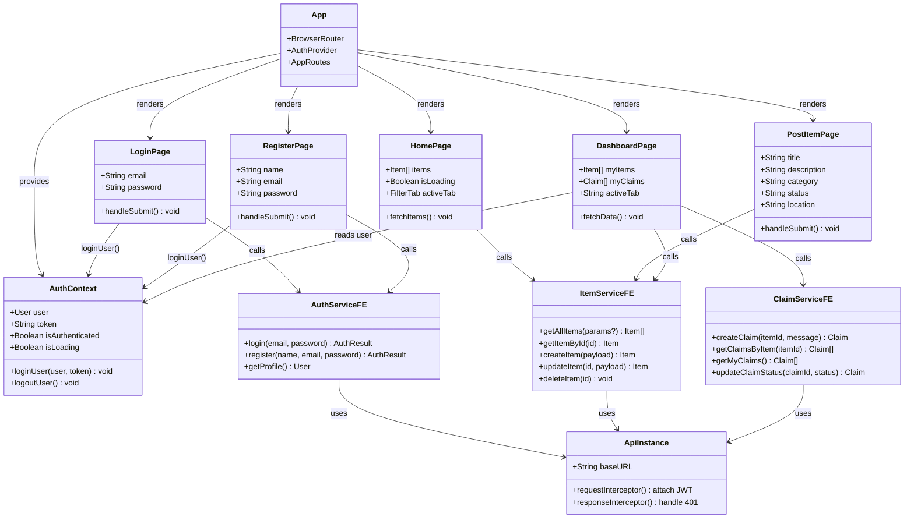

# 🏗️ Class Diagram — FoundIt Portal

## Overview

The class diagram represents the static structure of the FoundIt system, showing the classes (modules), their attributes, methods, and the relationships between them. This follows the **Clean Architecture** pattern with clear separation of concerns.

---

## System Class Diagram

```mermaid
classDiagram
    direction TB

    %% ════════════════════════════════════
    %%  DATABASE ENTITY CLASSES
    %% ════════════════════════════════════

    class User {
        +String id [PK, UUID]
        +String name
        +String email [UNIQUE]
        +DateTime created_at
        --
        Represents a registered user
    }

    class Item {
        +String id [PK, UUID]
        +String title
        +String description
        +String category
        +String status [lost | found | claimed]
        +String location
        +String image_url
        +String user_id [FK → User]
        +DateTime created_at
        +DateTime updated_at
        --
        Represents a lost or found item
    }

    class Claim {
        +String id [PK, UUID]
        +String item_id [FK → Item]
        +String user_id [FK → User]
        +String message
        +String status [pending | approved | rejected]
        +DateTime created_at
        --
        Represents a claim on an item
    }

    %% ════════════════════════════════════
    %%  SERVICE LAYER CLASSES
    %% ════════════════════════════════════

    class AuthService {
        +registerUser(name, email, password) AuthResult
        +loginUser(email, password) AuthResult
        +getUserProfile(userId) User
    }

    class ItemService {
        +createItem(data, userId) Item
        +getAllItems(filters?) Item[]
        +getItemById(id) Item
        +updateItem(id, data, userId) Item
        +deleteItem(id, userId) void
    }

    class ClaimService {
        +createClaim(data, userId) Claim
        +getClaimsByItem(itemId) Claim[]
        +getClaimsByUser(userId) Claim[]
        +updateClaimStatus(claimId, status, userId) Claim
    }

    %% ════════════════════════════════════
    %%  CONTROLLER LAYER CLASSES
    %% ════════════════════════════════════

    class AuthController {
        +registerController(req, res, next) void
        +loginController(req, res, next) void
        +getProfileController(req, res, next) void
    }

    class ItemController {
        +createItemController(req, res, next) void
        +getAllItemsController(req, res, next) void
        +getItemByIdController(req, res, next) void
        +updateItemController(req, res, next) void
        +deleteItemController(req, res, next) void
    }

    class ClaimController {
        +createClaimController(req, res, next) void
        +getClaimsByItemController(req, res, next) void
        +getClaimsByUserController(req, res, next) void
        +updateClaimStatusController(req, res, next) void
    }

    %% ════════════════════════════════════
    %%  MIDDLEWARE & UTILITY CLASSES
    %% ════════════════════════════════════

    class AuthMiddleware {
        +authMiddleware(req, res, next) void
        --
        Verifies JWT token via Supabase
        Injects req.user = id, email
    }

    class ApiResponse {
        +success(res, data, message) void
        +created(res, data, message) void
        +noContent(res) void
    }

    class ApiError {
        +Number statusCode
        +String message
        +Boolean isOperational
        +constructor(statusCode, message)
    }

    class ErrorHandler {
        +errorHandler(err, req, res, next) void
        --
        Catches ApiError and returns
        standardized error response
    }

    class SupabaseClient {
        +SupabaseClient instance
        --
        Singleton Supabase client
        initialized from env vars
    }

    %% ════════════════════════════════════
    %%  ROUTE CLASSES
    %% ════════════════════════════════════

    class AuthRoutes {
        +POST /register
        +POST /login
        +GET /me [protected]
    }

    class ItemRoutes {
        +POST /items [protected]
        +GET /items
        +GET /items/:id
        +PUT /items/:id [protected]
        +DELETE /items/:id [protected]
    }

    class ClaimRoutes {
        +POST /claims [protected]
        +GET /claims/item/:itemId
        +GET /claims/user [protected]
        +PATCH /claims/:claimId/status [protected]
    }

    %% ════════════════════════════════════
    %%  RELATIONSHIPS
    %% ════════════════════════════════════

    User "1" --> "0..*" Item : posts
    User "1" --> "0..*" Claim : submits
    Item "1" --> "0..*" Claim : receives

    AuthRoutes --> AuthController : maps to
    ItemRoutes --> ItemController : maps to
    ClaimRoutes --> ClaimController : maps to

    AuthController --> AuthService : calls
    ItemController --> ItemService : calls
    ClaimController --> ClaimService : calls

    AuthService --> SupabaseClient : uses
    ItemService --> SupabaseClient : uses
    ClaimService --> SupabaseClient : uses

    AuthService --> ApiError : throws
    ItemService --> ApiError : throws
    ClaimService --> ApiError : throws

    AuthController --> ApiResponse : returns
    ItemController --> ApiResponse : returns
    ClaimController --> ApiResponse : returns

    ItemRoutes --> AuthMiddleware : protects
    ClaimRoutes --> AuthMiddleware : protects
    AuthRoutes --> AuthMiddleware : protects /me

    ErrorHandler --> ApiError : handles
```

---

## Frontend Class Diagram

---

## Design Patterns Used

| Pattern | Where Applied | Purpose |
|---------|--------------|---------|
| **MVC (Model-View-Controller)** | Backend architecture | Separates data, logic, and presentation |
| **Repository Pattern** | Service layer → Supabase | Abstracts database operations |
| **Singleton** | SupabaseClient | Single database connection instance |
| **Middleware Chain** | Express middleware | Auth, error handling, CORS |
| **Observer Pattern** | React Context + useEffect | State change propagation |
| **Interceptor Pattern** | Axios interceptors | Cross-cutting concerns (auth, errors) |

---

*Document prepared for: **FoundIt — Lost & Found Portal***
*Version: 1.0 | Date: April 2026*
