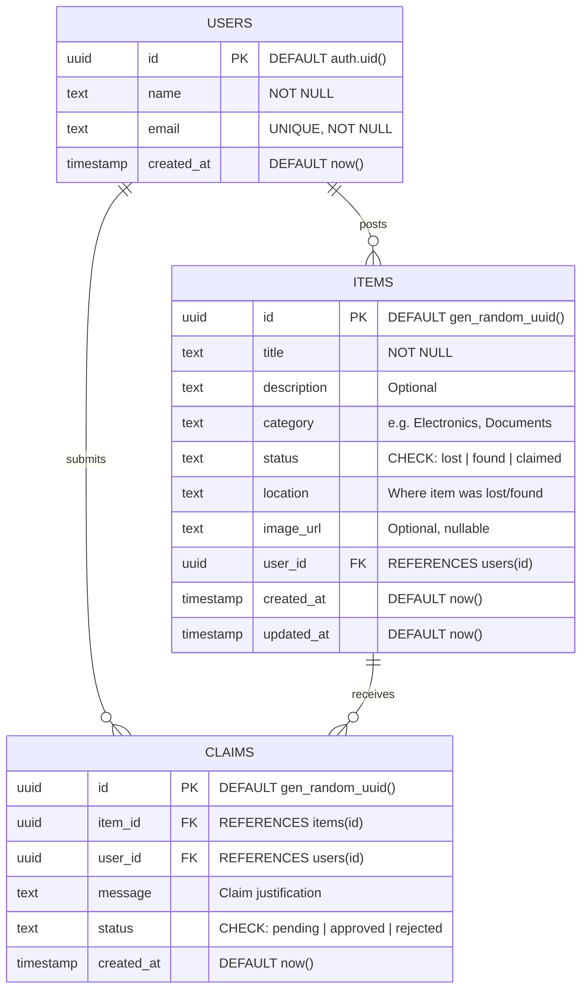
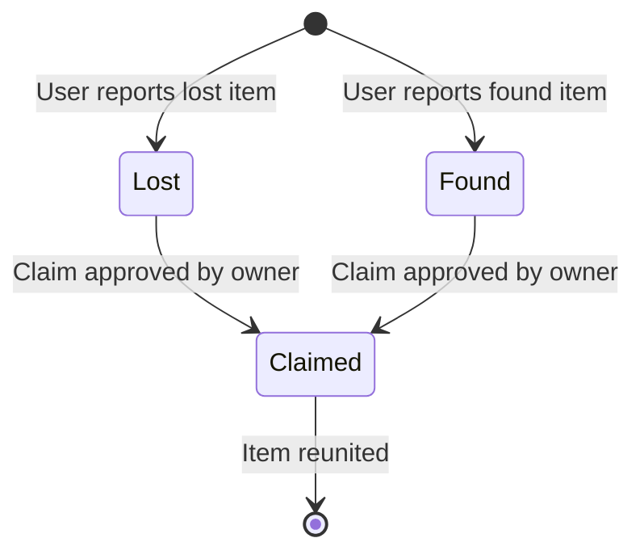
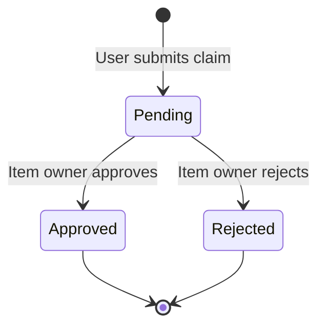

# 🗄️ ER Diagram — FoundIt Portal

## Overview

The Entity-Relationship Diagram represents the database schema of the FoundIt portal. The system uses **Supabase (PostgreSQL)** with three core entities connected through foreign key relationships, enforced with Row Level Security (RLS) policies.

---

## Entity-Relationship Diagram



---

## Entity Descriptions

### 1. USERS

> Stores registered user profiles. Automatically created via a database trigger when a user signs up through Supabase Auth.

| Column | Type | Constraints | Description |
|--------|------|-------------|-------------|
| `id` | `uuid` | **PK**, DEFAULT `auth.uid()` | Matches Supabase Auth user ID |
| `name` | `text` | NOT NULL | Display name |
| `email` | `text` | UNIQUE, NOT NULL | Login email |
| `created_at` | `timestamptz` | DEFAULT `now()` | Registration timestamp |

### 2. ITEMS

> Stores lost and found item reports. Each item belongs to exactly one user and can receive multiple claims.

| Column | Type | Constraints | Description |
|--------|------|-------------|-------------|
| `id` | `uuid` | **PK**, DEFAULT `gen_random_uuid()` | Unique item identifier |
| `title` | `text` | NOT NULL | Short item name |
| `description` | `text` | — | Detailed description |
| `category` | `text` | — | Category (Electronics, Documents, etc.) |
| `status` | `text` | CHECK `IN ('lost','found','claimed')` | Current item state |
| `location` | `text` | — | Where the item was lost/found |
| `image_url` | `text` | NULLABLE | URL to item image |
| `user_id` | `uuid` | **FK** → `users(id)`, ON DELETE CASCADE | Owner of the report |
| `created_at` | `timestamptz` | DEFAULT `now()` | Post timestamp |
| `updated_at` | `timestamptz` | DEFAULT `now()` | Last update timestamp |

### 3. CLAIMS

> Stores claims submitted by users who believe an item belongs to them. Each claim links a user to an item.

| Column | Type | Constraints | Description |
|--------|------|-------------|-------------|
| `id` | `uuid` | **PK**, DEFAULT `gen_random_uuid()` | Unique claim identifier |
| `item_id` | `uuid` | **FK** → `items(id)`, ON DELETE CASCADE | The item being claimed |
| `user_id` | `uuid` | **FK** → `users(id)`, ON DELETE CASCADE | The user submitting the claim |
| `message` | `text` | — | Why the user believes it's theirs |
| `status` | `text` | CHECK `IN ('pending','approved','rejected')` | Claim resolution state |
| `created_at` | `timestamptz` | DEFAULT `now()` | Submission timestamp |

---

## Relationships

| Relationship | Type | Description |
|-------------|------|-------------|
| `USERS → ITEMS` | **One-to-Many** | One user can post many items |
| `USERS → CLAIMS` | **One-to-Many** | One user can submit many claims |
| `ITEMS → CLAIMS` | **One-to-Many** | One item can receive many claims |

### Cardinality Details

```
USERS (1) ───────── (0..*) ITEMS
  │                          │
  │  A user may post         │  An item belongs to
  │  zero or more items      │  exactly one user
  │                          │
USERS (1) ───────── (0..*) CLAIMS
  │                          │
  │  A user may submit       │  A claim is submitted
  │  zero or more claims     │  by exactly one user
  │                          │
ITEMS (1) ───────── (0..*) CLAIMS
     │                       │
     │  An item may receive   │  A claim targets
     │  zero or more claims   │  exactly one item
```

---

## Indexes

| Index | Table | Column(s) | Purpose |
|-------|-------|-----------|---------|
| `idx_items_user_id` | items | `user_id` | Fast lookup of items by owner |
| `idx_items_status` | items | `status` | Fast filtering by lost/found/claimed |
| `idx_claims_item_id` | claims | `item_id` | Fast lookup of claims per item |
| `idx_claims_user_id` | claims | `user_id` | Fast lookup of claims by claimer |

---

## Row Level Security (RLS) Policies

| Table | Policy | Rule |
|-------|--------|------|
| `users` | SELECT own profile | `auth.uid() = id` |
| `items` | SELECT all | Everyone can read items |
| `items` | INSERT own | `auth.uid() = user_id` |
| `items` | UPDATE own | `auth.uid() = user_id` |
| `items` | DELETE own | `auth.uid() = user_id` |
| `claims` | SELECT own | `auth.uid() = user_id` |
| `claims` | INSERT | `auth.uid() = user_id` AND `user_id ≠ item.user_id` |
| `claims` | UPDATE status | Only item owner can approve/reject |

---

## SQL Schema (Reference)

```sql
-- USERS TABLE
CREATE TABLE public.users (
    id         UUID PRIMARY KEY DEFAULT auth.uid(),
    name       TEXT NOT NULL,
    email      TEXT UNIQUE NOT NULL,
    created_at TIMESTAMPTZ DEFAULT now()
);

-- ITEMS TABLE
CREATE TABLE public.items (
    id          UUID PRIMARY KEY DEFAULT gen_random_uuid(),
    title       TEXT NOT NULL,
    description TEXT,
    category    TEXT,
    status      TEXT CHECK (status IN ('lost', 'found', 'claimed')) DEFAULT 'lost',
    location    TEXT,
    image_url   TEXT,
    user_id     UUID REFERENCES public.users(id) ON DELETE CASCADE,
    created_at  TIMESTAMPTZ DEFAULT now(),
    updated_at  TIMESTAMPTZ DEFAULT now()
);

-- CLAIMS TABLE
CREATE TABLE public.claims (
    id         UUID PRIMARY KEY DEFAULT gen_random_uuid(),
    item_id    UUID REFERENCES public.items(id) ON DELETE CASCADE,
    user_id    UUID REFERENCES public.users(id) ON DELETE CASCADE,
    message    TEXT,
    status     TEXT CHECK (status IN ('pending', 'approved', 'rejected')) DEFAULT 'pending',
    created_at TIMESTAMPTZ DEFAULT now()
);

-- INDEXES
CREATE INDEX idx_items_user_id  ON public.items(user_id);
CREATE INDEX idx_items_status   ON public.items(status);
CREATE INDEX idx_claims_item_id ON public.claims(item_id);
CREATE INDEX idx_claims_user_id ON public.claims(user_id);
```

---

## State Transition Diagrams

### Item Status Lifecycle



### Claim Status Lifecycle



---

*Document prepared for: **FoundIt — Lost & Found Portal** | Version: 1.0 | April 2026*
