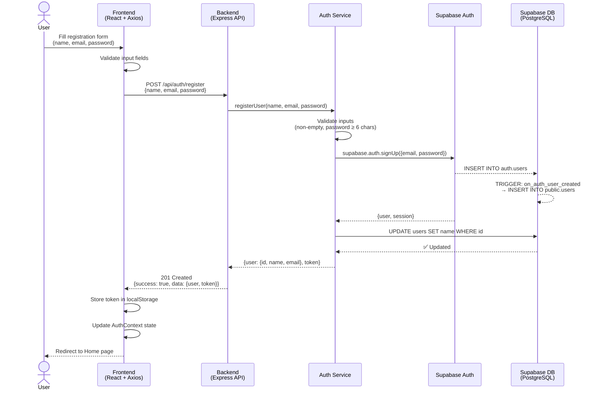
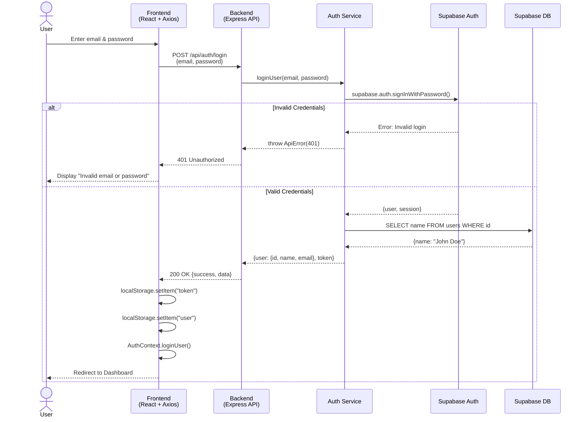
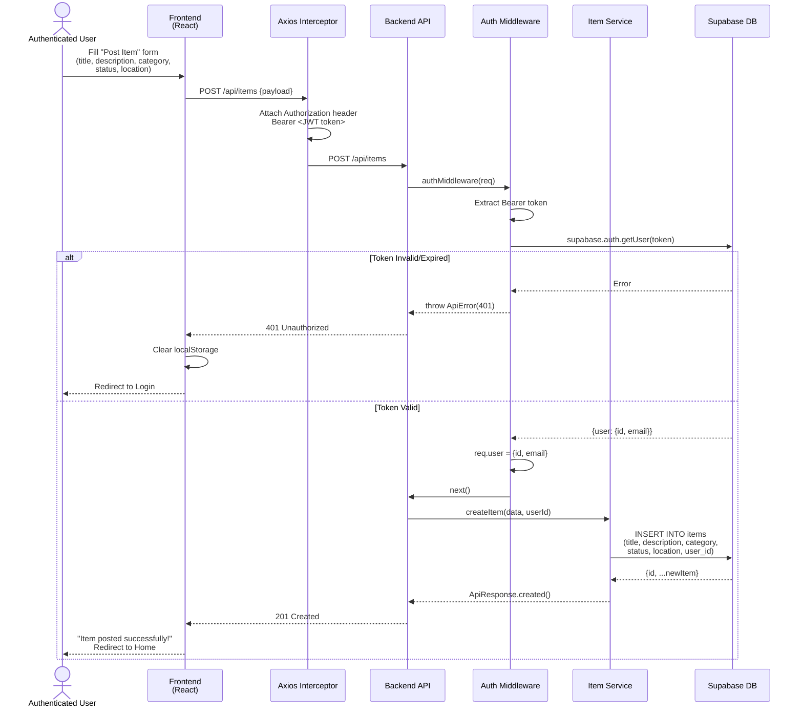
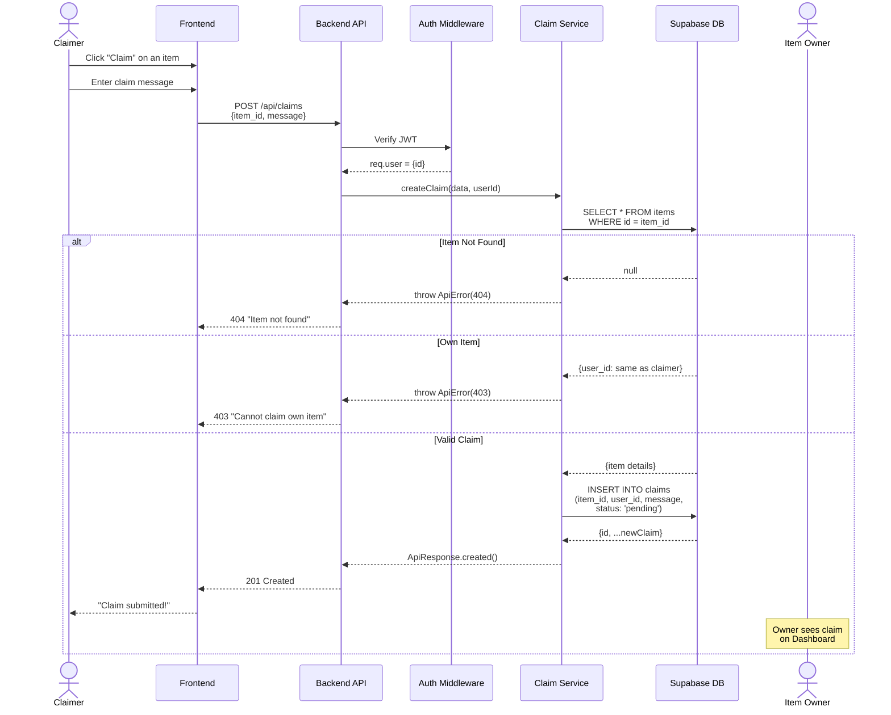
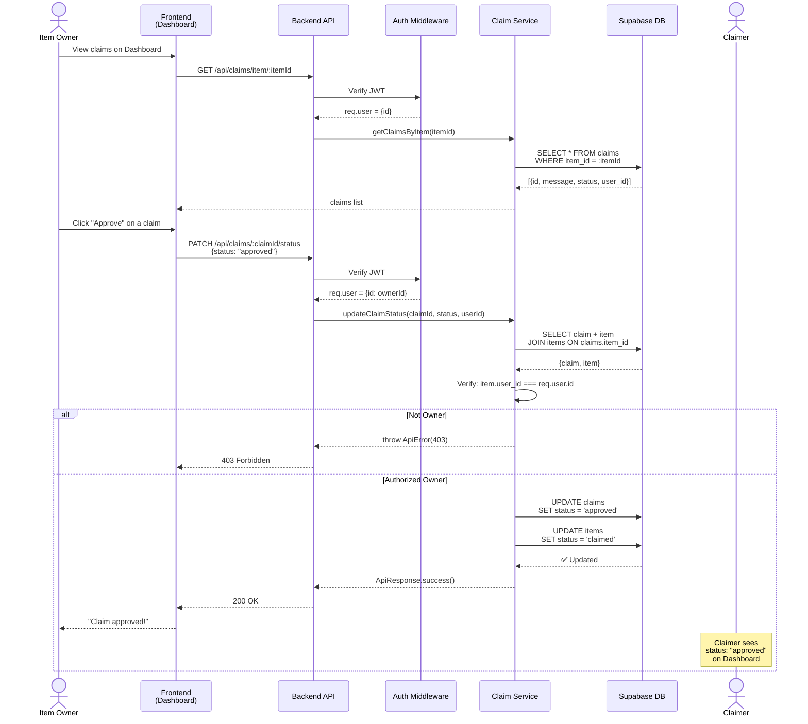
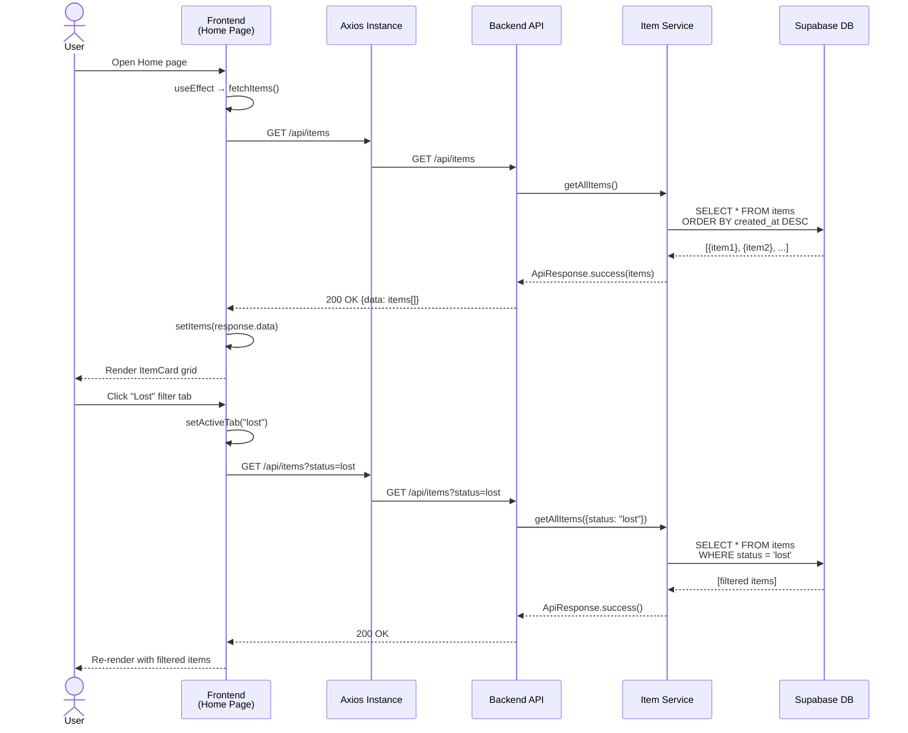

# 🔄 Sequence Diagrams — FoundIt Portal

## Overview

Sequence diagrams illustrate the interaction between system components over time for each major use case. They show the flow of messages between the **User (Browser)**, **Frontend (React)**, **Backend (Express API)**, **Auth Middleware**, and **Database (Supabase)**.

---

## 1. User Registration Flow

---

## 2. User Login Flow

---

## 3. Report Lost/Found Item Flow

---

## 4. Submit Claim Flow

---

## 5. Approve/Reject Claim Flow

---

## 6. Fetch & Filter Items Flow

---

*Document prepared for: **FoundIt — Lost & Found Portal***
*Version: 1.0 | Date: April 2026*
