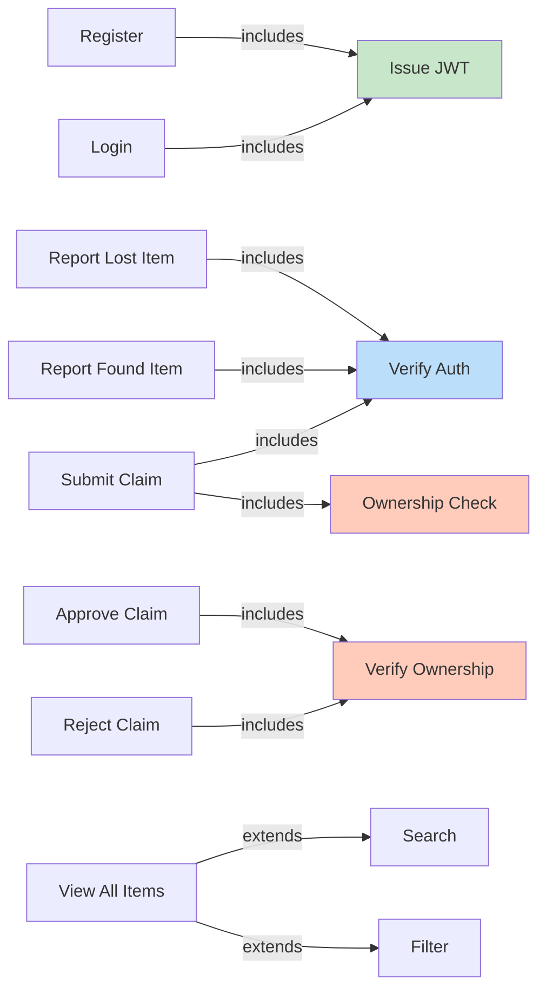

# 🎯 Use Case Diagram — FoundIt Portal

## System Use Case Diagram

```mermaid
graph TB
    subgraph System["🖥️ FoundIt — Lost and Found Portal"]
        direction TB
        subgraph Auth["🔐 Authentication"]
            UC1["Register Account"]
            UC2["Login"]
            UC3["Logout"]
            UC4["View Profile"]
        end
        subgraph Items["📦 Item Management"]
            UC5["Report Lost Item"]
            UC6["Report Found Item"]
            UC7["View All Items"]
            UC8["Search Items"]
            UC9["Filter by Status"]
            UC10["Edit Own Item"]
            UC11["Delete Own Item"]
        end
        subgraph Claims["📋 Claim Management"]
            UC12["Submit Claim"]
            UC13["View My Claims"]
            UC14["Approve Claim"]
            UC15["Reject Claim"]
        end
        subgraph Dash["📊 Dashboard"]
            UC16["View Stats"]
            UC17["View My Items"]
            UC18["Track Claim Status"]
        end
    end

    Guest(("👤 Guest"))
    RegUser(("👤 Registered User"))
    Owner(("👤 Item Owner"))

    Guest --> UC1
    Guest --> UC2
    Guest --> UC7
    Guest --> UC8
    Guest --> UC9

    RegUser --> UC3
    RegUser --> UC4
    RegUser --> UC5
    RegUser --> UC6
    RegUser --> UC7
    RegUser --> UC8
    RegUser --> UC9
    RegUser --> UC12
    RegUser --> UC13
    RegUser --> UC16
    RegUser --> UC17
    RegUser --> UC18

    Owner --> UC10
    Owner --> UC11
    Owner --> UC14
    Owner --> UC15

    style Auth fill:#e8f5e9,stroke:#2e7d32
    style Items fill:#e3f2fd,stroke:#1565c0
    style Claims fill:#fff3e0,stroke:#ef6c00
    style Dash fill:#f3e5f5,stroke:#7b1fa2
```

---

## Actor Descriptions

| Actor | Description | Authentication |
|-------|-------------|:-:|
| **Guest User** | Unauthenticated visitor who can browse items | ❌ |
| **Registered User** | Logged-in user who can post items and submit claims | ✅ |
| **Item Owner** | Registered user who owns an item and manages its claims | ✅ |

---

## Use Case Details

### 🔐 Authentication Module

| ID | Use Case | Actor | Precondition | Postcondition |
|----|----------|-------|-------------|---------------|
| UC1 | Register Account | Guest | Not logged in | Account created, JWT issued |
| UC2 | Login | Guest | Has account | JWT issued, redirected home |
| UC3 | Logout | Registered User | Logged in | Token cleared |
| UC4 | View Profile | Registered User | Logged in | Profile displayed |

### 📦 Item Management Module

| ID | Use Case | Actor | Precondition | Postcondition |
|----|----------|-------|-------------|---------------|
| UC5 | Report Lost Item | Registered User | Logged in | Item with status "lost" created |
| UC6 | Report Found Item | Registered User | Logged in | Item with status "found" created |
| UC7 | View All Items | Any | None | Item list rendered |
| UC8 | Search Items | Any | None | Filtered results shown |
| UC9 | Filter by Status | Any | None | Items filtered by lost/found |
| UC10 | Edit Own Item | Item Owner | Owns the item | Item updated |
| UC11 | Delete Own Item | Item Owner | Owns the item | Item removed |

### 📋 Claim Management Module

| ID | Use Case | Actor | Precondition | Postcondition |
|----|----------|-------|-------------|---------------|
| UC12 | Submit Claim | Registered User | Not own item | Claim created as "pending" |
| UC13 | View My Claims | Registered User | Logged in | Claims list displayed |
| UC14 | Approve Claim | Item Owner | Claim is pending | Claim approved, item → claimed |
| UC15 | Reject Claim | Item Owner | Claim is pending | Claim rejected |

### 📊 Dashboard Module

| ID | Use Case | Actor | Precondition | Postcondition |
|----|----------|-------|-------------|---------------|
| UC16 | View Stats | Registered User | Logged in | Stats cards displayed |
| UC17 | View My Items | Registered User | Logged in | User's items listed |
| UC18 | Track Claim Status | Registered User | Has claims | Statuses visible |

---

## Include / Extend Relationships

---

## Access Control Matrix

| Use Case | Guest | Registered | Owner |
|----------|:-----:|:----------:|:-----:|
| Register / Login | ✅ | — | — |
| View / Search Items | ✅ | ✅ | ✅ |
| Report Item | ❌ | ✅ | ✅ |
| Edit / Delete Item | ❌ | ❌ | ✅ |
| Submit Claim | ❌ | ✅ | ❌ own |
| Approve / Reject Claim | ❌ | ❌ | ✅ |
| Dashboard | ❌ | ✅ | ✅ |

---

*Document prepared for: **FoundIt — Lost & Found Portal** | Version: 1.0 | April 2026*
